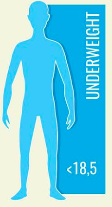
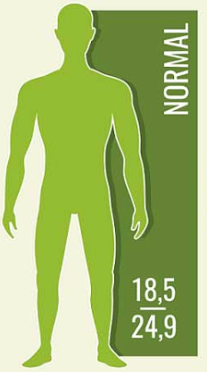
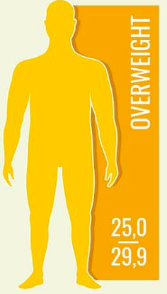
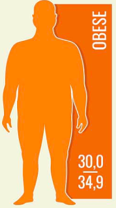
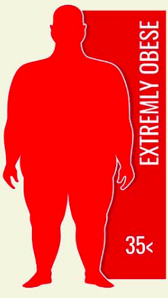

# IMC Calculator App

A simple, modern Flutter application to calculate your Body Mass Index (IMC/ BMI) and visualize your health category.


## Features

- **Instant BMI Calculation:** Enter your weight (kg) and height (m) to get your BMI instantly.
- **Health Category Display:** See your BMI category (e.g., Maigreur, Normal, Surpoids, Obésité) with a clear label and illustration.
- **Visual Feedback:** Friendly images and color-coded results for each BMI range.
- **Input Validation:** Prevents invalid or empty input with helpful error messages.
- **Responsive UI:** Clean, Material 3 design that works on all screen sizes.

## BMI Categories

| BMI Range   | Category           |
|-------------|--------------------|
| < 18.5      | Maigreur           |
| 18.5 – 25   | Normal             |
| 25 – 30     | Surpoids           |
| 30 – 40     | Obésité modérée    |
| > 40        | Obésité sévère     |

## Getting Started

1. **Clone the repository:**
   ```bash
   git clone https://github.com/youssef-baaziz/imc_app.git
   cd imc_app
   ```

2. **Install dependencies:**
   ```bash
   flutter pub get
   ```

3. **Run the app:**
   ```bash
   flutter run
   ```

## Screenshots

| Underweight | Normal Weight | Overweight | Obese | Extremely Obese |
|:-----------:|:-------------:|:----------:|:-----:|:---------------:|
|  |  |  |  |  |

## Project Structure

- `lib/main.dart` — Main application code
- `assets/img/` — Images for BMI categories

## Customization

- Update images in `assets/img/` to personalize the look.
- Adjust BMI ranges or categories in `main.dart` as needed.

## License

This project is open source and available under the [MIT License](LICENSE).

---

Made with ❤️ using [Flutter](https://flutter.dev/)
# flutter-imc-calculator
